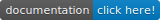

---
output:
  github_document
---

<!-- README.md is generated from README.Rmd. Please edit that file -->

```{r, echo = FALSE}
knitr::opts_chunk$set(
  collapse = TRUE,
  comment = "#>",
  fig.path = "README-"
)
```

# srvyr 
  <!-- badges: start -->
[](https://CRAN.R-project.org/package=srvyr)
[](https://github.com/gergness/srvyr/actions)
[](https://travis-ci.org/gergness/srvyr)
[](https://ci.appveyor.com/project/gergness/srvyr)
[](https://codecov.io/github/gergness/srvyr?branch=master)
[](http://gdfe.co/srvyr/)
<!-- badges: end -->

srvyr brings parts of [dplyr's](https://github.com/tidyverse/dplyr/) syntax to survey
analysis, using the [survey](https://CRAN.R-project.org/package=survey) 
package.

srvyr focuses on calculating summary statistics from survey data, such as the
mean, total or quantile. It allows for the use of  many dplyr verbs, such as
`summarize`, `group_by`, and `mutate`, the convenience of pipe-able functions,
rlang's style of non-standard evaluation and more consistent return types
than the survey package.

You can try it out:

```R
install.packages("srvyr")
# or for development version
# devtools::install_github("gergness/srvyr")
```

## Example usage

First, describe the variables that define the survey's structure with the function
`as_survey()`with the bare column names of the names that you would use in functions
from the survey package like `survey::svydesign()`, `survey::svrepdesign()` or 
`survey::twophase()`.

```{r}
library(srvyr, warn.conflicts = FALSE)
data(api, package = "survey")

dstrata <- apistrat %>%
   as_survey_design(strata = stype, weights = pw)
```

Now many of the dplyr verbs are available.

* `mutate()` adds or modifies a variable.
```{r}
dstrata <- dstrata %>%
  mutate(api_diff = api00 - api99)
```

* `summarise()` calculates summary statistics such as mean, total, quantile or ratio.
```{r}
dstrata %>% 
  summarise(api_diff = survey_mean(api_diff, vartype = "ci"))
```

* `group_by()` and then `summarise()` creates summaries by groups.
```{r}
dstrata %>% 
  group_by(stype) %>%
  summarise(api_diff = survey_mean(api_diff, vartype = "ci"))
```

* Functions from the survey package are still available:
```{r}
my_model <- survey::svyglm(api99 ~ stype, dstrata)
summary(my_model)
```

## What people are saying about srvyr
> [srvyr] lets us use the survey library’s functions within a data analysis 
> pipeline in a familiar way.
> 
> -- <cite>Kieran Healy, in [Data Visualization: A practical introduction](https://socviz.co/modeling.html#plots-from-complex-surveys) </cite>


> 1. Yay!
> 
> --<cite>Thomas Lumley, [in the Biased and Inefficient blog](http://notstatschat.tumblr.com/post/161225885311/pipeable-survey-analysis-in-r)</cite>


## Contributing
I do appreciate bug reports, suggestions and pull requests! I started this as a
way to learn about R package development, and am still learning, so you'll have
to bear with me. Please review the [Contributor Code of
Conduct](https://github.com/gergness/srvyr/blob/master/CODE_OF_CONDUCT.md), as all participants are required to abide by its
terms.

If you're unfamiliar with contributing to an R package, I recommend the guides
provided by Rstudio's tidyverse team, such as Jim Hester's [blog
post](https://www.tidyverse.org/blog/2017/08/contributing/) or Hadley
Wickham's [R packages book](https://r-pkgs.org/).
