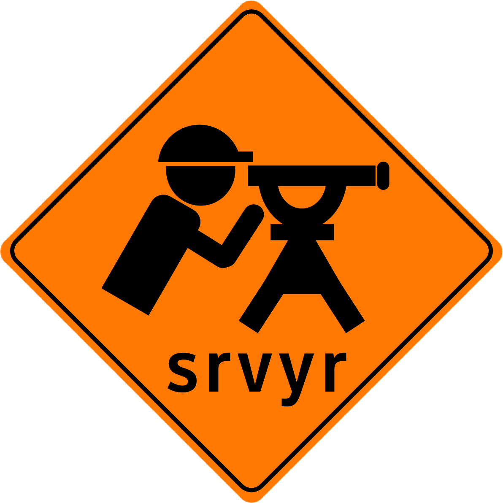

<!-- README.md is generated from README.Rmd. Please edit that file -->

# srvyr 

<!-- badges: start -->

[](https://CRAN.R-project.org/package=srvyr)
[](https://github.com/gergness/srvyr/actions)
[](https://app.codecov.io/gh/gergness/srvyr?branch=main)
[](http://gdfe.co/srvyr/)
<!-- badges: end -->

srvyr brings parts of [dplyr’s](https://github.com/tidyverse/dplyr/)
syntax to survey analysis, using the
[survey](https://CRAN.R-project.org/package=survey) package.

srvyr focuses on calculating summary statistics from survey data, such
as the mean, total or quantile. It allows for the use of many dplyr
verbs, such as `summarize`, `group_by`, and `mutate`, the convenience of
pipe-able functions, rlang’s style of non-standard evaluation and more
consistent return types than the survey package.

You can try it out:

``` r
install.packages("srvyr")
# or for development version
# remotes::install_github("gergness/srvyr")
```

## Example usage

First, describe the variables that define the survey’s structure with
the function `as_survey()`with the bare column names of the names that
you would use in functions from the survey package like
`survey::svydesign()`, `survey::svrepdesign()` or `survey::twophase()`.

``` r
library(srvyr, warn.conflicts = FALSE)
data(api, package = "survey")

dstrata <- apistrat %>%
   as_survey_design(strata = stype, weights = pw)
```

Now many of the dplyr verbs are available.

-   `mutate()` adds or modifies a variable.

``` r
dstrata <- dstrata %>%
  mutate(api_diff = api00 - api99)
```

-   `summarise()` calculates summary statistics such as mean, total,
    quantile or ratio.

``` r
dstrata %>% 
  summarise(api_diff = survey_mean(api_diff, vartype = "ci"))
#> # A tibble: 1 × 3
#>   api_diff api_diff_low api_diff_upp
#>      <dbl>        <dbl>        <dbl>
#> 1     32.9         28.8         37.0
```

-   `group_by()` and then `summarise()` creates summaries by groups.

``` r
dstrata %>% 
  group_by(stype) %>%
  summarise(api_diff = survey_mean(api_diff, vartype = "ci"))
#> # A tibble: 3 × 4
#>   stype api_diff api_diff_low api_diff_upp
#>   <fct>    <dbl>        <dbl>        <dbl>
#> 1 E        38.6         33.1          44.0
#> 2 H         8.46         1.74         15.2
#> 3 M        26.4         20.4          32.4
```

-   Functions from the survey package are still available:

``` r
my_model <- survey::svyglm(api99 ~ stype, dstrata)
summary(my_model)
#> 
#> Call:
#> svyglm(formula = api99 ~ stype, design = dstrata)
#> 
#> Survey design:
#> Called via srvyr
#> 
#> Coefficients:
#>             Estimate Std. Error t value Pr(>|t|)    
#> (Intercept)   635.87      13.34  47.669   <2e-16 ***
#> stypeH        -18.51      20.68  -0.895    0.372    
#> stypeM        -25.67      21.42  -1.198    0.232    
#> ---
#> Signif. codes:  0 '***' 0.001 '**' 0.01 '*' 0.05 '.' 0.1 ' ' 1
#> 
#> (Dispersion parameter for gaussian family taken to be 16409.56)
#> 
#> Number of Fisher Scoring iterations: 2
```

## Learning more

Here are some free resources put together by the community about srvyr:

-   **“How-to”s & examples of using srvyr**
    -   srvyr’s included vignette [“srvyr vs
        survey”](http://gdfe.co/srvyr/articles/srvyr-vs-survey.html) and
        the rest of the [pkgdown website](http://gdfe.co/srvyr/)
    -   Stephanie Zimmer & Rebecca Powell’s [2021 AAPOR Workshop “Tidy
        Survey Analysis in R using the srvyr
        Package”](https://github.com/szimmer/tidy-survey-aapor-2021)
    -   “The Epidemiologist R Handbook”, by Neale Batra et al. has a
        [chapter on survey analysis](https://epirhandbook.com/en/) with
        srvyr and survey package examples
    -   Kieran Healy’s book [“Data Visualization: A Practical
        Introduction”](https://socviz.co/modeling.html#plots-from-complex-surveys)
        has a section on using srvyr to visualize the ESS.
    -   The IPUMS PMA team’s blog had a series showing examples of using
        the [PMA COVID survey panel with
        weights](https://tech.popdata.org/pma-data-hub/index.html)
    -   [“Open Case Studies: Vaping Behaviors in American
        Youth”](https://www.opencasestudies.org/ocs-bp-vaping-case-study/)
        by Carrie Wright, Michael Ontiveros, Leah Jager, Margaret Taub,
        and Stephanie Hicks is a detailed case study that includes using
        srvyr to analyze the National Youth Tobacco Survey.
    -   [“How to plot Likert scales with a weighted survey in a dplyr
        friendly
        way”](https://towardsdatascience.com/how-to-plot-likert-scales-with-a-weighted-survey-in-a-dplyr-friendly-way-68df600881a)
        by Francisco Suárez Salas
    -   The tidycensus package vignette [“Working with Census
        microdata”](https://walker-data.com/tidycensus/articles/pums-data.html)
        includes information about using the weights from the ACS
        retrieved from the census API.
    -   [“The Joy of Calculating the Direct Standard Error for PUMS
        Estimates”](https://ldaly.github.io/giveinandblogit/) by GitHub
        user @ldaly
-   **About survey statistics**
    -   Thomas Lumley’s book [“Complex Surveys: a guide to analysis
        using R”](http://r-survey.r-forge.r-project.org/svybook/)
    -   [Chris Skinner. Jon Wakefield. “Introduction to the Design and
        Analysis of Complex Survey Data.” Statist. Sci. 32 (2) 165 -
        175, May 2017.
        10.1214/17-STS614](https://projecteuclid.org/accountAjax/Download?downloadType=journal%20article&urlId=10.1214%2F17-STS614&isResultClick=True)
    -   Sharon Lohr’s textbook “Sampling: Design and Analysis”.
        [Second](https://www.sharonlohr.com/sampling-design-and-analysis-2e)
        or
        [Third](https://www.sharonlohr.com/sampling-design-and-analysis-3e)
        Editions
    -   “Survey weighting is a mess” is the opening to Andrew Gelman’s
        [“Struggles with Survey Weighting and Regression
        Modeling”](http://www.stat.columbia.edu/~gelman/research/published/STS226.pdf)
    -   Anthony Damico’s website [“Analyze Survey Data for
        Free”](http://asdfree.com) has the weight specifications for a
        wide variety of public use survey datasets.
-   **Working programmatically and/or on multiple columns at once (eg
    `dplyr::across` and `rlang`’s “curly curly” `{{}}`)**
    -   dplyr’s included package vignettes [“Column-wise
        operations”](https://dplyr.tidyverse.org/articles/colwise.html)
        & [“Programming with
        dplyr”](https://dplyr.tidyverse.org/articles/programming.html)
-   **Non-English resources**
    -   *Em português:* [“Análise de Dados Amostrais
        Complexos”](https://djalmapessoa.github.io/adac/) by Djalma
        Pessoa and Pedro Nascimento Silva
    -   *En español:* [“Usando R para jugar con los microdatos del
        INEGI”](https://medium.com/tacosdedatos/usando-r-para-sacar-información-de-los-microdatos-del-inegi-b21b6946cf4f)
        by Claudio Daniel Pacheco Castro
    -   *Tiếng Việt:* [“Dịch tễ học ứng dụng và y tế công cộng với
        R”](https://epirhandbook.com/vn/survey-analysis.html)
-   **Other cool stuff that uses srvyr**
    -   A (free) graphical interface allowing exploratory data analysis
        of survey data without writing code:
        [iNZight](https://inzight.nz/) (and [survey data
        instructions](https://inzight.nz/docs/survey-specification.html))
    -   [“serosurvey: Serological Survey Analysis For Prevalence
        Estimation Under
        Misclassification”](https://avallecam.github.io/serosurvey/) by
        Andree Valle Campos
    -   Several packages on CRAN depend on srvyr, you can see them by
        looking at the [reverse Imports/Suggestions on
        CRAN](https://cran.r-project.org/package=srvyr).

**Still need help?**

I think the best way to get help is to form a specific question and ask
it in some place like [rstudio’s community
website](https://community.rstudio.com) (known for it’s friendly
community) or [stackoverflow.com](https://stackoverflow.com) (maybe not
known for being quite as friendly, but probably has more people). If you
think you’ve found a bug in srvyr’s code, please file an [issue on
GitHub](https://github.com/gergness/srvyr/issues/new), but note that I’m
not a great resource for helping specific issue, both because I have
limited capacity but also because I do not consider myself an expert in
the statistical methods behind survey analysis.

**Have something to add?**

These resources were mostly found via vanity searches on twitter &
github. If you know of anything I missed, or have written something
yourself, [please let me know in this GitHub
issue](https://github.com/gergness/srvyr/issues/127)!

## What people are saying about srvyr

> minimal changes to my \#r \#dplyr script to incorporate survey
> weights, thanks to the amazing \#srvyr and \#survey packages. Thanks
> to @gregfreedman & @tslumley. Integrates soooo nicely into tidyverse
>
> –<cite>Brian Guay ([@BrianMGuay on Jun 16,
> 2021](https://twitter.com/brianmguay/status/1405224564196622338))</cite>

> Spending my afternoon using `srvyr` for tidy analysis of weighted
> survey data in \#rstats and it’s so elegant. Vignette here:
> <https://CRAN.R-project.org/package=srvyr/vignettes/srvyr-vs-survey.html>
>
> –<cite>Chris Skovron ([@cskovron on Nov 20,
> 2018](https://twitter.com/cskovron/status/1065015904784842752))</cite>

> 1.  Yay!
>
> –<cite>Thomas Lumley, [in the Biased and Inefficient
> blog](http://notstatschat.tumblr.com/post/161225885311/pipeable-survey-analysis-in-r)</cite>

## Contributing

I do appreciate bug reports, suggestions and pull requests! I started
this as a way to learn about R package development, and am still
learning, so you’ll have to bear with me. Please review the [Contributor
Code of
Conduct](https://github.com/gergness/srvyr/blob/main/CODE_OF_CONDUCT.md),
as all participants are required to abide by its terms.

If you’re unfamiliar with contributing to an R package, I recommend the
guides provided by Rstudio’s tidyverse team, such as Jim Hester’s [blog
post](https://www.tidyverse.org/blog/2017/08/contributing/) or Hadley
Wickham’s [R packages book](https://r-pkgs.org/).
