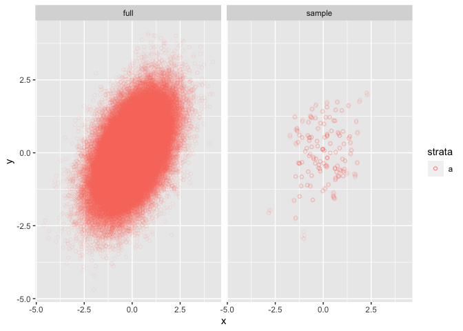

Correlation Intuition
================

Goal is to simulate a survey design of a population with a known
correlation structure.

Was able to come up with weighting that adds bias to the estimate of
correlation and clustering that throws off our estiamtes of uncertainty.
Strategy for weighting is to create a positive correlation between x & y
for the full population, then up-weight the top left and bottom right
quadrants. Then sample 1/5 the number of points we want, and grab 4 of
the closest 20 points to first round of selection to create our
clusters. Originally wanted to have strata too, but having trouble
getting strata to be intuitive in this simple example.

``` r
pop_o_mag <- 5
sim_cov <- matrix(c(1, 0.5, 0.5, 1), ncol = 2)
weighting_func <- function(x, y) {
    case_when(
        (x >= 0.5 & y <= -0.5) | (x <= -0.5 & y >= 0.5) ~ 40,
        TRUE ~ 200
    )
}
cluster_size <- 5
cluster_out_of <- 20
```

``` r
samp_size <- 10 ^ pop_o_mag
num_fmt <- paste0("%0", pop_o_mag, "d")

full_pop <- mvrnorm(samp_size, c(0, 0), sim_cov)
colnames(full_pop) <- c("x", "y")


full_pop <- full_pop |>
    as_tibble() |> 
    mutate(
        id = sprintf(num_fmt, row_number()),
        wt = weighting_func(x, y),
        # --- Never came up with an intuitive example of strata but
        # --- include it here in case it's useful
        strata = "a"
    )
```

``` r
# --- Helpers
make_sample_data <- function(full_pop) {
    first_round_cov_biased_sample <- full_pop |>
        group_by(wt) |>
        group_map(function(x, grp) slice_sample(x, prop = 1 / (grp$wt * cluster_size)) |> mutate(wt = grp$wt)) |>
        bind_rows() %>%
        mutate(cluster_id = sprintf(num_fmt, row_number()))
    
    used_ids_env <- rlang::env(used_ids = first_round_cov_biased_sample$id)
    
    cov_biased_sample <- first_round_cov_biased_sample |>
        group_by(strata) |>
        reframe(nearest_unused_neighbors(cur_group()$strata, pick(everything()), ui_env = used_ids_env))
}

nearest_unused_neighbors <- function(strata, selected_data, ui_env) {
    unused_full_pop <- full_pop |> 
        filter(strata == !!strata & !(id %in% ui_env$used_ids))
    
    quick_join <- right_join(
        unused_full_pop,
        selected_data |> mutate(x_high = x + 0.05, x_low = x - 0.05, y_high = y + 0.05, y_low = y - 0.05),
        by = join_by(between(x, x_low, x_high), between(y, y_low, y_high)),
        suffix = c("", "_orig")
    ) |>
        group_by(cluster_id) |>
        reframe(inner_nearest_unused_neigbors(cur_group()$cluster_id, pick(everything()), ui_env))
    
    quick_failure_ids <- quick_join |>
        filter(is.na(id)) |>
        pull(cluster_id)
    
    if (length(quick_failure_ids) == 0) {
        out <- bind_rows(
            selected_data |> mutate(strata = strata),
            quick_join
        ) |> arrange(cluster_id)
        return(out)
    }
    
    unused_full_pop <- unused_full_pop |> filter(!id %in% ui_env$used_ids)
    quick_failures <- selected_data |>
        filter(cluster_id %in% quick_failure_ids) |>
        cross_join(unused_full_pop, suffix = c("_orig", "")) |>
        group_by(cluster_id) |>
        reframe(inner_nearest_unused_neigbors(cur_group()$cluster_id, pick(everything()), ui_env))
        
    
    bind_rows(
        selected_data |> mutate(strata = strata),
        quick_join |> filter(!is.na(id)),
        quick_failures
    )
}

inner_nearest_unused_neigbors <- function(cluster_id, potential_cluster_data, ui_env) {
    out <- potential_cluster_data |>
        filter(!id %in% ui_env$used_ids) 
    
    if (nrow(out) < (cluster_size - 1)) {
        return(tibble(id = NA_character_))
    }
    out <- out |>
        mutate(dist = sqrt((x - x_orig)^2 + (y - y_orig)^2)) %>%
        filter(row_number(dist) <= cluster_out_of) |>
        slice_sample(n = cluster_size - 1)
    
    ui_env$used_ids <- c(ui_env$used_ids, out$id)
    out |>
        select(id, x, y, strata, wt)
}
```

``` r
samples <- map(1:100, ~make_sample_data(full_pop), .progress = TRUE)
```

    ## ■ 1% | ETA: 4m ■■ 2% | ETA: 4m ■■ 3% | ETA: 4m ■■ 4% | ETA: 4m ■■■ 5% | ETA: 4m
    ## ■■■ 6% | ETA: 4m ■■■ 7% | ETA: 3m ■■■ 8% | ETA: 3m ■■■■ 9% | ETA: 3m ■■■■ 10% |
    ## ETA: 3m ■■■■ 11% | ETA: 3m ■■■■■ 12% | ETA: 3m ■■■■■ 13% | ETA: 3m ■■■■■ 14% |
    ## ETA: 3m ■■■■■ 15% | ETA: 3m ■■■■■■ 16% | ETA: 3m ■■■■■■ 17% | ETA: 3m ■■■■■■
    ## 18% | ETA: 3m ■■■■■■■ 19% | ETA: 3m ■■■■■■■ 20% | ETA: 3m ■■■■■■■ 21% | ETA: 3m
    ## ■■■■■■■■ 22% | ETA: 3m ■■■■■■■■ 23% | ETA: 3m ■■■■■■■■ 24% | ETA: 3m ■■■■■■■■■
    ## 25% | ETA: 3m ■■■■■■■■■ 26% | ETA: 3m ■■■■■■■■■ 27% | ETA: 3m ■■■■■■■■■ 28% |
    ## ETA: 3m ■■■■■■■■■■ 29% | ETA: 3m ■■■■■■■■■■ 30% | ETA: 3m ■■■■■■■■■■ 31% | ETA:
    ## 3m ■■■■■■■■■■■ 32% | ETA: 2m ■■■■■■■■■■■ 33% | ETA: 2m ■■■■■■■■■■■ 34% | ETA:
    ## 2m ■■■■■■■■■■■ 35% | ETA: 2m ■■■■■■■■■■■■ 36% | ETA: 2m ■■■■■■■■■■■■ 37% | ETA:
    ## 2m ■■■■■■■■■■■■ 38% | ETA: 2m ■■■■■■■■■■■■■ 39% | ETA: 2m ■■■■■■■■■■■■■ 40% |
    ## ETA: 2m ■■■■■■■■■■■■■ 41% | ETA: 2m ■■■■■■■■■■■■■■ 42% | ETA: 2m ■■■■■■■■■■■■■■
    ## 43% | ETA: 2m ■■■■■■■■■■■■■■ 44% | ETA: 2m ■■■■■■■■■■■■■■■ 45% | ETA: 2m
    ## ■■■■■■■■■■■■■■■ 46% | ETA: 2m ■■■■■■■■■■■■■■■ 47% | ETA: 2m ■■■■■■■■■■■■■■■ 48%
    ## | ETA: 2m ■■■■■■■■■■■■■■■■ 49% | ETA: 2m ■■■■■■■■■■■■■■■■ 50% | ETA: 2m
    ## ■■■■■■■■■■■■■■■■ 51% | ETA: 2m ■■■■■■■■■■■■■■■■■ 52% | ETA: 2m
    ## ■■■■■■■■■■■■■■■■■ 53% | ETA: 2m ■■■■■■■■■■■■■■■■■ 54% | ETA: 2m
    ## ■■■■■■■■■■■■■■■■■ 55% | ETA: 2m ■■■■■■■■■■■■■■■■■■ 56% | ETA: 2m
    ## ■■■■■■■■■■■■■■■■■■ 57% | ETA: 2m ■■■■■■■■■■■■■■■■■■ 58% | ETA: 2m
    ## ■■■■■■■■■■■■■■■■■■■ 59% | ETA: 1m ■■■■■■■■■■■■■■■■■■■ 60% | ETA: 1m
    ## ■■■■■■■■■■■■■■■■■■■ 61% | ETA: 1m ■■■■■■■■■■■■■■■■■■■■ 62% | ETA: 1m
    ## ■■■■■■■■■■■■■■■■■■■■ 63% | ETA: 1m ■■■■■■■■■■■■■■■■■■■■ 64% | ETA: 1m
    ## ■■■■■■■■■■■■■■■■■■■■■ 65% | ETA: 1m ■■■■■■■■■■■■■■■■■■■■■ 66% | ETA: 1m
    ## ■■■■■■■■■■■■■■■■■■■■■ 67% | ETA: 1m ■■■■■■■■■■■■■■■■■■■■■ 68% | ETA: 1m
    ## ■■■■■■■■■■■■■■■■■■■■■■ 69% | ETA: 1m ■■■■■■■■■■■■■■■■■■■■■■ 70% | ETA: 1m
    ## ■■■■■■■■■■■■■■■■■■■■■■ 71% | ETA: 1m ■■■■■■■■■■■■■■■■■■■■■■■ 72% | ETA: 1m
    ## ■■■■■■■■■■■■■■■■■■■■■■■ 73% | ETA: 1m ■■■■■■■■■■■■■■■■■■■■■■■ 74% | ETA: 1m
    ## ■■■■■■■■■■■■■■■■■■■■■■■ 75% | ETA: 1m ■■■■■■■■■■■■■■■■■■■■■■■■ 76% | ETA: 1m
    ## ■■■■■■■■■■■■■■■■■■■■■■■■ 77% | ETA: 1m ■■■■■■■■■■■■■■■■■■■■■■■■ 78% | ETA: 48s
    ## ■■■■■■■■■■■■■■■■■■■■■■■■■ 79% | ETA: 46s ■■■■■■■■■■■■■■■■■■■■■■■■■ 80% | ETA:
    ## 44s ■■■■■■■■■■■■■■■■■■■■■■■■■ 81% | ETA: 41s ■■■■■■■■■■■■■■■■■■■■■■■■■■ 82% |
    ## ETA: 39s ■■■■■■■■■■■■■■■■■■■■■■■■■■ 83% | ETA: 37s ■■■■■■■■■■■■■■■■■■■■■■■■■■
    ## 84% | ETA: 35s ■■■■■■■■■■■■■■■■■■■■■■■■■■■ 85% | ETA: 33s
    ## ■■■■■■■■■■■■■■■■■■■■■■■■■■■ 86% | ETA: 30s ■■■■■■■■■■■■■■■■■■■■■■■■■■■ 87% |
    ## ETA: 28s ■■■■■■■■■■■■■■■■■■■■■■■■■■■ 88% | ETA: 26s
    ## ■■■■■■■■■■■■■■■■■■■■■■■■■■■■ 89% | ETA: 24s ■■■■■■■■■■■■■■■■■■■■■■■■■■■■ 90% |
    ## ETA: 22s ■■■■■■■■■■■■■■■■■■■■■■■■■■■■ 91% | ETA: 20s
    ## ■■■■■■■■■■■■■■■■■■■■■■■■■■■■■ 92% | ETA: 17s ■■■■■■■■■■■■■■■■■■■■■■■■■■■■■ 93%
    ## | ETA: 15s ■■■■■■■■■■■■■■■■■■■■■■■■■■■■■ 94% | ETA: 13s
    ## ■■■■■■■■■■■■■■■■■■■■■■■■■■■■■ 95% | ETA: 11s ■■■■■■■■■■■■■■■■■■■■■■■■■■■■■■ 96%
    ## | ETA: 9s ■■■■■■■■■■■■■■■■■■■■■■■■■■■■■■ 97% | ETA: 6s
    ## ■■■■■■■■■■■■■■■■■■■■■■■■■■■■■■ 98% | ETA: 4s ■■■■■■■■■■■■■■■■■■■■■■■■■■■■■■■
    ## 99% | ETA: 2s

``` r
# --- Summarize results
list(full = full_pop, sample = samples[[1]]) |>
    bind_rows(.id = "type") |> 
    ggplot(aes(x = x, y = y, color = strata)) +
    geom_point(alpha = 0.1, shape = 1) +
    facet_wrap(~type) +
    guides(color = guide_legend(override.aes = list(alpha = 0.8)))
```

<!-- -->

``` r
# --- Simulation covariance:
sim_cov
```

    ##      [,1] [,2]
    ## [1,]  1.0  0.5
    ## [2,]  0.5  1.0

``` r
# --- Calculated corr?
sim_cov[1, 2] / (sqrt(sim_cov[1, 1]) * sqrt(sim_cov[2, 2]))
```

    ## [1] 0.5

``` r
# --- Full simulated pop correlation:
cor(full_pop |> select(x, y))[1, 2]
```

    ## [1] 0.4972825

``` r
# --- unweighted covariace:
cor(samples[[1]] |> select(x, y))[1, 2]
```

    ## [1] 0.1563774

``` r
# --- Weighted correlation without strat or cluster
without_cluster <- map_dfr(samples, ~.|>
            as_survey(weight = wt) |>
            summarize(x = survey_corr(x, y, vartype = "ci"))
) |> mutate(actual = cor(full_pop |> select(x, y))[1, 2]) |>
    mutate(in_interval = actual >= x_low & actual <= x_upp) 

head(without_cluster)
```

    ## # A tibble: 6 × 5
    ##       x x_low x_upp actual in_interval
    ##   <dbl> <dbl> <dbl>  <dbl> <lgl>      
    ## 1 0.451 0.385 0.517  0.497 TRUE       
    ## 2 0.559 0.507 0.610  0.497 FALSE      
    ## 3 0.488 0.428 0.548  0.497 TRUE       
    ## 4 0.508 0.454 0.563  0.497 TRUE       
    ## 5 0.446 0.384 0.507  0.497 TRUE       
    ## 6 0.515 0.464 0.567  0.497 TRUE

``` r
without_cluster |>
    summarize(in_interval = mean(in_interval))
```

    ## # A tibble: 1 × 1
    ##   in_interval
    ##         <dbl>
    ## 1        0.61

``` r
# --- Weighted correlation with cluster
with_cluster <- map_dfr(samples, ~.|>
            as_survey(cluster_id, weight = wt) |>
            summarize(x = survey_corr(x, y, vartype = "ci"))
) |> mutate(actual = cor(full_pop |> select(x, y))[1, 2]) |>
    mutate(in_interval = actual >= x_low & actual <= x_upp) 

head(with_cluster)
```

    ## # A tibble: 6 × 5
    ##       x x_low x_upp actual in_interval
    ##   <dbl> <dbl> <dbl>  <dbl> <lgl>      
    ## 1 0.451 0.303 0.599  0.497 TRUE       
    ## 2 0.559 0.442 0.675  0.497 TRUE       
    ## 3 0.488 0.354 0.623  0.497 TRUE       
    ## 4 0.508 0.385 0.632  0.497 TRUE       
    ## 5 0.446 0.308 0.583  0.497 TRUE       
    ## 6 0.515 0.401 0.630  0.497 TRUE

``` r
with_cluster |>
    summarize(in_interval = mean(in_interval))
```

    ## # A tibble: 1 × 1
    ##   in_interval
    ##         <dbl>
    ## 1        0.93
